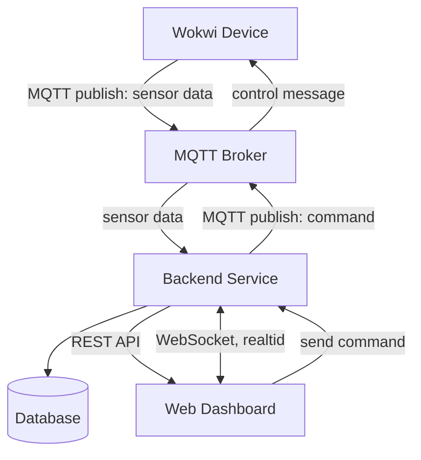

# Assignment: Internet of Things (IoT)

Hardware and sensors are increasingly integrated into everyday products. As a web developer, understanding how to communicate with connected devices using lightweight protocols is a valuable skill.

In this assignment, you will build an end-to-end IoT pipeline: simulate a device, publish sensor data through MQTT, store and process data in your backend, and present it in a real-time web dashboard that can also send commands back to the device.

## Learning Outcomes

By completing this assignment, you will:
- Collect and stream real-time sensor data using MQTT.
- Design a basic architecture for IoT data ingestion and visualization.
- Store time-series data in a suitable database.
- Build a bi-directional dashboard for monitoring and control.

## Assignment Description

You will simulate an IoT device in [Wokwi](https://wokwi.com/). The simulated device should:
- Read values from a sensor (or sensors).
- Publish sensor data to an MQTT broker on a recurring interval.
- Subscribe to command topics and react to incoming control messages (for example, toggling an LED).

You will also build a dashboard interface that:
- Subscribes to sensor updates in real time.
- Visualizes current and/or historical values.
- Publishes command messages back to the device.

You are expected to implement persistence and realtime data handling using one of these mandatory implementation paths:
- **Path A (Custom app stack):** custom backend + custom dashboard UI.
- **Path C (Node-RED stack):** Node-RED flow + Node-RED dashboard UI.

## Minimum Requirements (Mandatory / G)

Your solution must include:
- A working Wokwi simulation.
- A data-processing layer that ingests sensor data from MQTT (custom backend or Node-RED flow).
- MQTT publish and subscribe flows (device -> dashboard/backend and dashboard -> device).
- A deployed dashboard UI (custom frontend or Node-RED dashboard).
- Persistent data storage in a database of your choice.
- A historical data access layer for dashboard initialization (custom API or Node-RED data flow).
- A short report documenting your implementation.

Wokwi setup:
- Use a starter project that is provided in Moodle
- Or build your own equivalent setup (MCU + sensor + LED).

## Recommended MQTT Topics and Payloads

Use your own topic namespace to avoid collisions. Replace `[student_id]` with your own identifier.

### Sensor Data (published by Wokwi)
- **Topic:** `lnu/iot/[student_id]/sensor`
- **Payload (JSON):**

```json
{
  "value": 45,
  "timestamp": 1710063386
}
```

### Device Commands (published by dashboard, subscribed by Wokwi)
- **Topic:** `lnu/iot/[student_id]/command/led`
- **Payload (JSON):**

```json
{
  "state": true
}
```

If you use additional sensors or controls, document all related topics and payload schemas in your report.

## Submission Report

### 1) Project Links
- **Live Dashboard URL:** Later
- **Wokwi Simulation URL:** Later
- **Backend/Database URL:** Later
- **Repository URL:** Later

### 2) Project Overview
This project implements an end-to-end IoT pipeline that simulates a connected device, 
collects sensor data, stores it in a database, and presents it in a real-time web dashboard.

The simulated hardware consists of an ESP32 microcontroller with a DHT22 temperature and 
humidity sensor and an LED, all running in Wokwi. The device publishes sensor readings 
every 5 seconds to an MQTT broker and listens for incoming LED control commands.

The dashboard allows the user to:
- View the current temperature and humidity readings in real time
- See a historical chart of temperature and humidity over time
- Toggle the LED on the simulated device via a button


- Above is the IoT setup in WOKWI with the ESP32, DHT22 senor and the light (currently off)


- Above is the IoT setup in WOKWI with the ESP32, DHT22 senor and the light (currently on)


- Above is the dashboard which is made via recharts and displays humidity, temperature aswell as a button for turning on or off the light

### 3) Architecture and Data Flow

Data flows through the system in two directions:

**Sensor data flow (device to dashboard):**
The Wokwi ESP32 reads temperature and humidity from the DHT22 sensor every 5 seconds 
and publishes a JSON payload to the MQTT broker (HiveMQ) over MQTT. The Express backend 
subscribes to this topic, parses the payload, appends a server timestamp, and stores it 
in MongoDB Atlas. The React dashboard also subscribes directly to the same topic via 
WebSocket and updates the chart in real time without a page refresh.

**Command flow (dashboard to device):**
When the user clicks the LED button in the dashboard, the frontend sends an HTTP POST 
request to the Express backend. The backend then publishes a JSON command to the LED 
command topic on HiveMQ. The Wokwi device is subscribed to this topic and toggles the 
LED based on the received state.


### 4) Database Strategy

- **Database chosen:** MongoDB Atlas
- **Data model:** A single collection called `sensorreadings` with the following schema:

```json
{
  "_id": "ObjectId",
  "temperature": "Number",
  "humidity": "Number",
  "timestamp": "Number (timestamp from device)",
  "createdAt": "Date (automatically added by MongoDB)",
  "updatedAt": "Date (automatically added by MongoDB)"
}
```

- **Time-series considerations:**
  - Documents are timestamped with both the device timestamp and a server side 
    `createdAt` field added automatically by Mongoose via the `timestamps: true` option
  - Historical data is queried by sorting on `createdAt` in descending order and 
    limiting to the 50 most recent readings, keeping the API response fast and 
    frontend-friendly
  - No manual retention or aggregation policy is implemented, but the 
    limit of 50 readings per query prevents sending excessive data to the frontend
  - MongoDB was chosen for simplicity, as the data volume at this scale does not require specialized 
    time-series optimizations

### 5) MQTT Topics and Payload Documentation

**Topic 1 — Sensor Data**
- **Topic:** `lnu/iot/it222hp/sensor`
- **Direction:** Wokwi → HiveMQ → Express Backend + React Dashboard
- **Published by:** Wokwi ESP32 every 5 seconds
- **Example payload:**
```json
{
  "temperature": 24.0,
  "humidity": 40.0,
  "timestamp": 997
}
```

| Field | Type | Description |
|-------|------|-------------|
| temperature | Number | Temperature in Celsius from DHT22 |
| humidity | Number | Relative humidity percentage from DHT22 |
| timestamp | Number | Seconds elapsed since device boot |

---

**Topic 2 — LED Command**
- **Topic:** `lnu/iot/it222hp/command/led`
- **Direction:** React Dashboard → Express Backend → HiveMQ → Wokwi
- **Published by:** Express backend when LED button is clicked in dashboard
- **Example payload:**
```json
{
  "state": true
}
```

| Field | Type | Description |
|-------|------|-------------|
| state | Boolean | true = LED on, false = LED off |

### 6) Reflection

**1. Which frontend technologies did you choose, and why?**

I chose React with TypeScript and Vite for the frontend. React was a natural choice 
as it is what I am most comfortable with from previous coursework, and its component 
model made it easy to split the dashboard into logical pieces like the chart, current 
values display, and LED control button. TypeScript was added to catch type errors early, 
especially useful when working with sensor data payloads coming from an external source. 
Vite was used as the build tool because it is fast and has built-in support for 
environment variables via `import.meta.env`, which made managing secrets straightforward. 
For the chart I used Recharts as it integrates cleanly with React and supports real-time 
data updates out of the box.

**2. How does handling real-time MQTT data over WebSockets differ from a standard 
REST API workflow?**

With a standard REST API the client has to actively request data by sending an HTTP 
request and waiting for a response. This is a pull-based model, the client controls 
when it gets data. With MQTT over WebSocket the connection is persistent and push-based. 
Once the frontend subscribes to a topic, the broker automatically pushes new messages 
to the client the moment they arrive, without any request being made. This means the 
dashboard updates instantly when new sensor data is published, without polling or 
page refreshes. The tradeoff is added complexity because you need to manage the connection 
lifecycle, handle reconnections, and clean up the client when the component unmounts.

**3. What was the most challenging integration step, and how did you solve it?**

The most challenging step was getting the MQTT WebSocket connection working in the 
browser. The backend uses `mqtts://` with port 8883 for raw MQTT over SSL, but browsers 
cannot use raw TCP connections as they require WebSocket. This meant the frontend needed 
to use `wss://` with port 8884 and the `/mqtt` path. Finding the correct URL format 
took some debugging. Additionally, Reacts StrictMode caused the MQTT client to be 
created twice in development, which led to a "client disconnecting" error when the 
cleanup function of the first instance ended the connection before the second instance 
could subscribe. This was solved by removing StrictMode from `main.tsx` and adding a 
unique `clientId` to each connection to prevent conflicts on the broker side.


## Hand-in Instructions

Submit your work by creating a Merge Request targeting the `lnu/submit-branch`.

If you used additional repositories or external services, include links to them in your submission report.

## Grade Levels

- **G:** Complete all mandatory requirements in this README.
- **VG:** Complete all mandatory requirements **and** at least one optional VG extension.

### Grading Policy Mapping

- **Mandatory (G) mapping:** Equivalent to completing Issue 1-7 in `ISSUES.md`.
- **Issue 4 path rule:** You must complete either Path A (custom API) or Path C (Node-RED historical access), and document your chosen approach.
- **Optional (VG) mapping:** Equivalent to completing at least one of VG-A, VG-B, or VG-C in `ISSUES.md`.

For any VG extension, include:
- Security considerations (secrets handling, credentials, access restrictions).
- Evidence (screenshots/video/logs) and short technical reflection.


## Submission Report Template

Include the following sections in your report:

### 1) Project Links
- **Live Dashboard URL:** [Link to deployed frontend, e.g. Vercel/Netlify/Cumulus]
- **Wokwi Simulation URL:** [Public Wokwi project link]
- **Backend/Database URL:** [Link to deployed backend stack, if applicable]
- **Repository URL:** [Link to your source code]

### 2) Project Overview
Briefly describe:
- What your project does.
- Which hardware/sensors you simulated.
- What the dashboard allows the user to monitor/control.

### 3) Architecture and Data Flow
Explain how data moves through your system:
- Wokwi device -> MQTT broker -> processing layer/database -> dashboard.
- Dashboard -> MQTT command topic -> device action.

Use the placeholder below and replace it with your own architecture screenshot or diagram:

```md
[Insert architecture diagram or screenshot here]
```

Your diagram must explicitly label the communication protocols used between components (for example MQTT, WebSocket, HTTP/HTTPS).

Example Mermaid diagram (you can copy and adapt):



### 4) Database Strategy
Document:
- **Database chosen:** (for example InfluxDB, MongoDB, TimescaleDB)
- **Data model:** measurement/collection/table structure
- **Time-series considerations:** retention, indexing, query strategy, aggregation, etc.

### 5) MQTT Topics and Payload Documentation
List all topics used and provide example payloads. This should be precise enough to serve as integration documentation for your device and dashboard communication.

### 6) Reflection
Answer the following:
1. Which frontend technologies did you choose, and why?
2. How does handling real-time MQTT data over WebSockets differ from a standard REST API workflow?
3. What was the most challenging integration step (hardware, broker, backend, database, frontend), and how did you solve it?